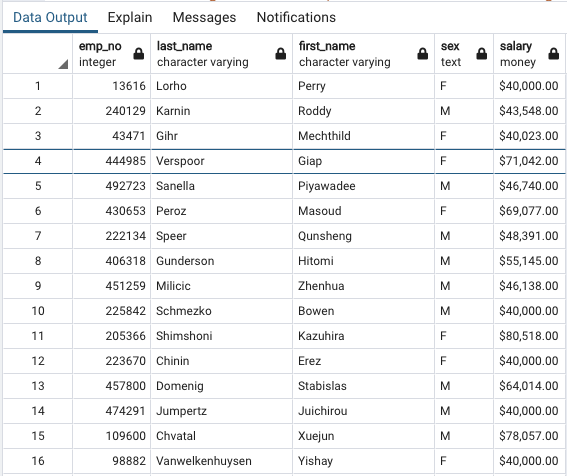
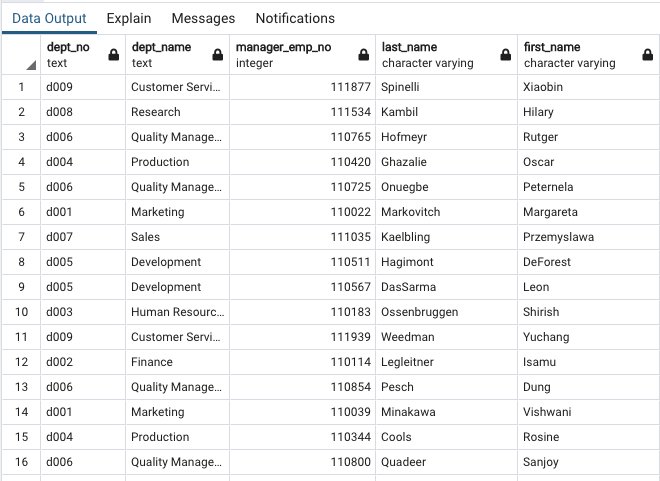

# SQL-challenge Homework  

This homework required me to plan out the relationship between tables to create a working database.  After creating the database I needed to build some queries to answer 8 questions about the database.  Following below are the challenges I encountered and the answers to the questions and the bonus sections.

# Creating Tables

My first challenge came after creating all the tables when I forgot to create Primary and Foreign keys.  The ERD I created was wrong regarding the relationships to other tables.

Once I figured out the correct ERD I started to create tables again but didn't take into consideration the order of creation so I had errors.  After creating them in the correct order I had an error with my last table dept_emp because there was no unique value to assign as a PK so I created a composite key.

One challenge that I had and still haven't resolved is the deleting tables code.  I would get errors due to relationship issues and tried to add CASCADE but still didn't work.  In the end I manually deleted the tables when I was working through but will go back and solve it.

# Questions

1. List the following details of each employee: employee number, last name, first name, sex, and salary.

2. List first name, last name, and hire date for employees who were hired in 1986

3. List the manager of each department with the following information: department number, department name, the manager's employee number, last name, first name.

4. List the department of each employee with the following information: employee number, last name, first name, and department name.

5. List first name, last name, and sex for employees whose first name is "Hercules" and last names begin with "B."

6. List all employees in the Sales department, including their employee number, last name, first name, and department name.

7. List all employees in the Sales and Development departments, including their employee number, last name, first name, and department name.

8. In descending order, list the frequency count of employee last names, i.e., how many employees share each last name.

  

# BONUS

For the bonus I had to connect to my database via Jupyter Notebook and put some data into DataFrames for analysis.  The main challenge was getting the engine created to connect.  Once that was done it was fairly easy except when I ran into the salary data was in string format with commas and $ sign.  When I removed it it wasn't in a DF any longer but a series and I couldn't figure out why.  I was however able to create the histogram of salaries and the bar chart of the average salaries by employee title.  It seems the salaries were perfectly distributed to average out the same for every title.  

​										  

  

